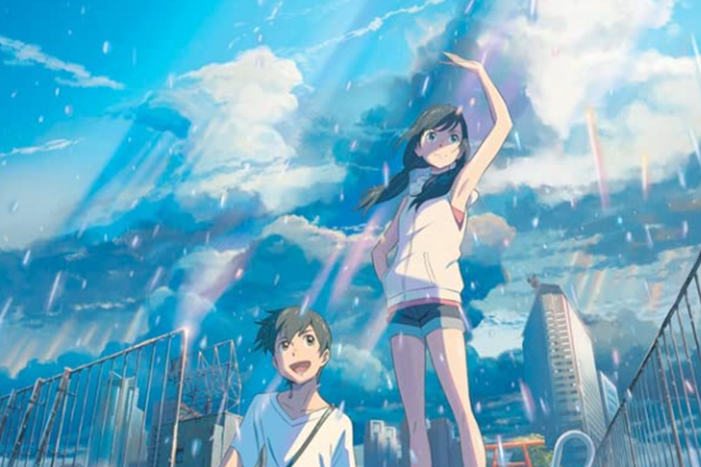

# My Favorite movie

**Weathering with you**

*2019 Japanese animated romantic fantasy film written and directed by Makoto Shinkai, produced by CoMix Wave Films and distributed by Toho. It follows a 16-year-old high school boy, Hodaka Morishima, who runs away from his troubled rural home to Tokyo, and later befriends Hina Amano, an orphaned girl who has the ability to control the weather.*

